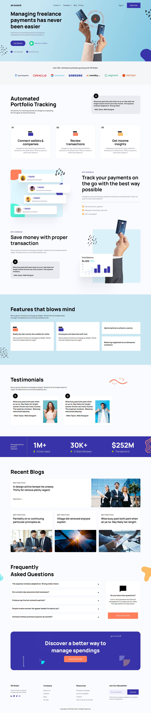

# intuji-frontend-internship-challenge
> internship enrollment task given at [intuji](https://intuji.com/)

## Task:
build a frontend webpage given design in figma

## Solution
used stack
1. HTML
2. SASS (Syntactically Awesome Style Sheets) - precompiled CSS
3. jQuery
4. google fonts

## Demo
[here](https://raman-shakya.github.io/intuji-frontend-internship-challenge/)
> deployed using github pages

## Animation Briefing
1. **NavBar**
    * Scroll - stick to top effect with gradiating background blur and opacity
    * underline effect for nav content [Product, Template, Blog, Pricing] on hover

2. **Hero**
    * Onload animations including hands, stamp and doodles are included. Along with onhover enlargement effect.
    * Slide animation on hover of `See How it Works` button, using pseduo label elements
    * Hover enlarging effect for `Get Started`  button

3. **Companies Section**
    * Hover enlarging effect on company logos

4. **Services Section**
    * Hover enlarging effect on all testimonials, sub-articles and image elements.

5. **Features Section**
    * Hover enlarging effect on each feature block

6. **Testimonial Section**
    * Hover enlarging effect on testimonial block

7. **Statistics Section**
    * Hover enlarging effect on each statistical data

8. **Recent Blogs**
    * Hover enlarging effect on each blog block

9. **FAQ Section**
    * FAQ onclick, changes class to animate which enlarges answer section making it visible
    * Hover enlarging effect on FAQ section

10. **CTA Section**
    * CTA button `Shoot a Direct Mail` onhover background color changing animation

11. **Footer Section**
    * anchor tag bold effect

## Responsive Design
1. Fonts were minimized for small screen
2. Removal of removable elements in small screen
3. Flexbox responsive design, (*font-wrap* and *media query flex-direction*)

## RESULT
